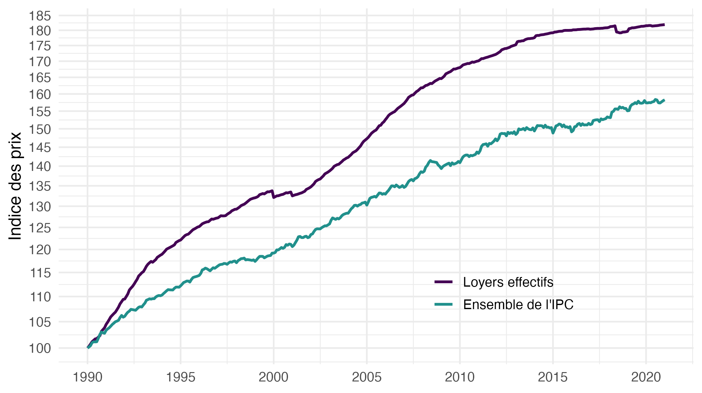
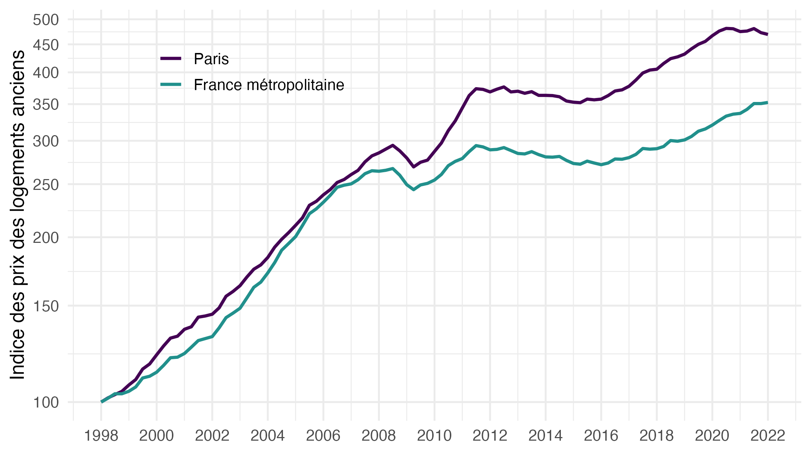

# Au sujet du Blog de l’Insee du 4 février 2020 « Mais si, l’Insee prend bien en compte le logement dans l’inflation ! »

Date de publication: 22 février 2022.

Ce dépôt met à disposition des codes de réplication pour la note en lien [pdf](https://fgeerolf.com/blog-insee-IPC-loyers.pdf), [html](https://fgeerolf.com/blog-insee-IPC-loyers.html), [docx](https://fgeerolf.com/blog-insee-IPC-loyers.docx).

  <!-- Reader Navigation -->
  **[📖 Lire en ligne](https://fgeerolf.com/blog-insee-IPC-loyers.html)** •
  **[📄 Version PDF](https://fgeerolf.com/blog-insee-IPC-loyers.pdf)** •
  **[🌐 Présentation HTML](https://fgeerolf.com/blog-insee-IPC-loyers-handouts.html)**•
  **[📓 Présentation PDF](https://fgeerolf.com/blog-insee-IPC-loyers-slides.pdf)** 

## Codes de Réplication

### Figure 6: IPC Ensemble vs. IPC loyers effectifs

[Code R](R/figure6.R)

### Figure 7: Indice des prix des logements anciens, France métropolitaine et Paris

[Code R](R/figure7.R)

