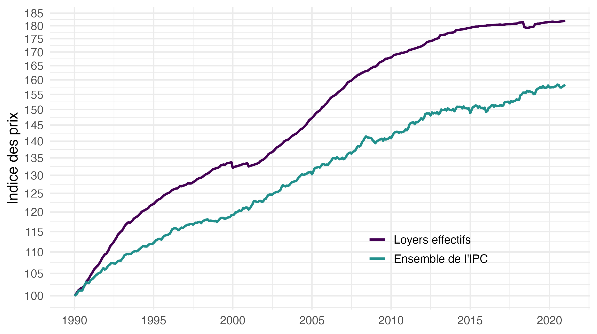
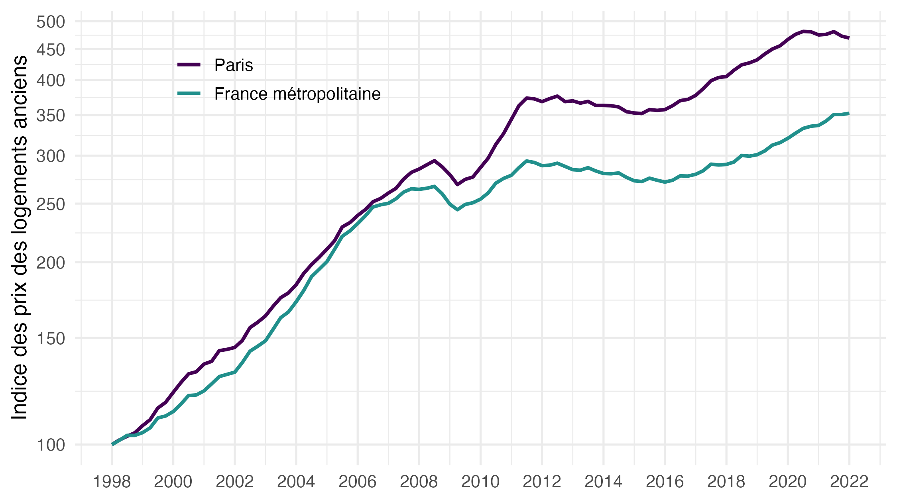

# Quelques remarques au sujet du Blog de l’Insee du 4 février 2020 « Mais si, l’Insee prend bien en compte le logement dans l’inflation ! »

Date de publication: 22 février 2022.

Ce dépôt met à disposition des codes de réplication pour la note en lien [pdf](https://fgeerolf.com/blog-insee-IPC-loyers.pdf), [html](https://fgeerolf.com/blog-insee-IPC-loyers.html), [docx](https://fgeerolf.com/blog-insee-IPC-loyers.docx).

## Codes de Réplication

### Figure 1: IPC Ensemble vs. IPC loyers effectifs

[Code R](figure1.R)

### Figure 2: Indice des prix des logements anciens, France métropolitaine et Paris

[Code R](figure2.R)

